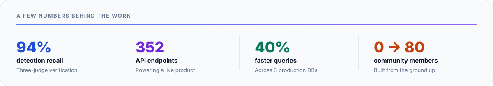
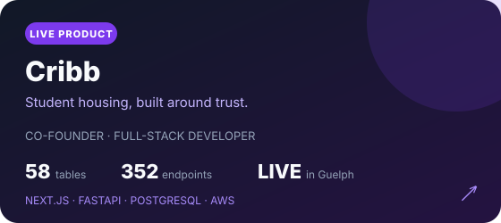
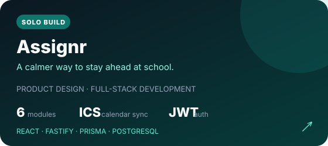
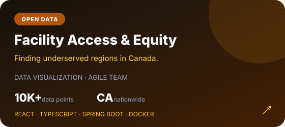
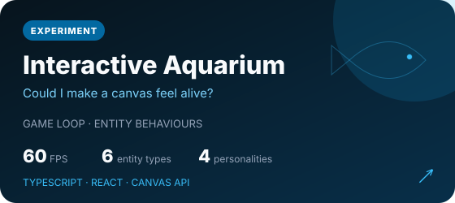

<picture>
  <source media="(prefers-color-scheme: dark)" srcset="./assets/profile-header-dark.svg">
  <source media="(prefers-color-scheme: light)" srcset="./assets/profile-header-light.svg">
  
</picture>

  
  
  

  I like building software around messy, real-world problems—especially when the job is turning 
  unreliable inputs into something people can actually <strong>trust and use</strong>.

 

<picture>
  <source media="(prefers-color-scheme: dark)" srcset="./assets/impact-dark.svg">
  <source media="(prefers-color-scheme: light)" srcset="./assets/impact-light.svg">
  
</picture>

## Selected work

<table>
  <tr>
    <td width="50%"></td>
    <td width="50%"></td>
  </tr>
  <tr>
    <td width="50%"></td>
    <td width="50%"></td>
  </tr>
</table>

<a href="https://www.davidamaefula.com/projects"><strong>See the stories behind the builds →</strong></a>

## The short version

I'm a software developer at **Adknown**, co-founder of **Cribb**, and a final-year **Computing (Co-op)** student at the University of Guelph. Most of my work sits between full-stack product engineering, data, and AI.

- At **Adknown**, I'm the sole developer of a self-maintaining AI research system: roughly **18,000 lines of Python**, 29 CLI tools, a 19-table datastore, and a 365-finding knowledge base.
- At **Cribb**, I build everything from database and product flows to AI-assisted comparison, document verification, and agent integrations—all for a platform being used by real students and landlords.
- At **AudiPsalm**, I reduced average query time by **40%** across three production databases and helped cut releases from **45 minutes to under five**.

What ties it together is pretty simple: I like shipping things, measuring whether they work, and leaving the code clearer than I found it.

<strong>Tools I've shipped with</strong>

 

**Languages** · Python · TypeScript · JavaScript · SQL · Java · C# · Bash

**Product & backend** · React · Next.js · FastAPI · Node.js · Fastify · Prisma · PostgreSQL · MySQL

**AI & data** · Anthropic API · OpenAI API · Multi-provider orchestration · AWS Textract · ETL · Schema design

**Cloud & delivery** · AWS · Azure · Docker · Terraform · GitLab CI/CD · Vercel · Render · n8n · Playwright

**Integrations** · OAuth · JWT · Stripe · Shopify · REST APIs · MCP

## Away from the keyboard

I founded the University of Guelph chapter of **BLW Campus Ministry** and grew it from zero to **80 members**. Running a community has taught me a lot about listening, earning trust, and changing the plan when the people you're building for tell you something isn't working.

<table>
  <tr><td>🔨 <strong>Building</strong></td><td>AI research automation at Adknown</td></tr>
  <tr><td>🚀 <strong>Shipping</strong></td><td>Cribb for students and landlords in Guelph</td></tr>
  <tr><td>🧠 <strong>Exploring</strong></td><td>Safer multi-provider LLM orchestration and evaluation</td></tr>
  <tr><td>🎓 <strong>Studying</strong></td><td>Computing (Co-op) + Project Management at U of Guelph</td></tr>
</table>

 

  <strong>Have an interesting problem to solve?</strong>  
  

