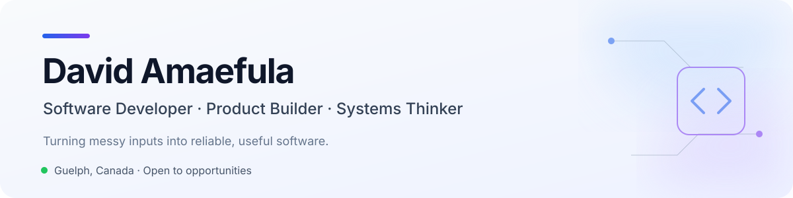

<picture>
  <source media="(prefers-color-scheme: dark)" srcset="./assets/profile-header-dark.svg">
  <source media="(prefers-color-scheme: light)" srcset="./assets/profile-header-light.svg">
  
</picture>

<p align="center">
  <a href="https://www.davidamaefula.com"><strong>Portfolio</strong></a>
  &nbsp;·&nbsp;
  <a href="https://www.davidamaefula.com/resume"><strong>Résumé</strong></a>
  &nbsp;·&nbsp;
  <a href="https://www.linkedin.com/in/david-amaefula-817719266/"><strong>LinkedIn</strong></a>
  &nbsp;·&nbsp;
  <a href="mailto:amaefuladavid@outlook.com"><strong>Email</strong></a>
</p>

## What I do

I'm a final-year **Computing (Co-op)** student at the University of Guelph and a software developer at **Adknown**. I build full-stack products, data systems, and AI automation that turn unstructured inputs into dependable, useful software.

- Building a multi-provider AI research platform across **Python, FastAPI, AWS, and modern LLM APIs**
- Shipped database and delivery improvements that made queries **40% faster** and releases **9× faster**
- Co-founded and launched **Cribb**, a student housing platform spanning seven connected product areas
- Open to software engineering opportunities where product thinking and reliable systems matter

## Selected work

| Project | What I built | Stack |
| :--- | :--- | :--- |
| **[Cribb](https://www.davidamaefula.com/projects/cribb)** · [Live ↗](https://findyourcribb.com) | Student housing platform with verified listings, roommate matching, real-time messaging, marketplace, and AI-assisted comparison. **Co-founder & frontend lead.** | Next.js · TypeScript · FastAPI · PostgreSQL · WebSockets |
| **[Assignr](https://www.davidamaefula.com/projects/assignr)** · [Live ↗](https://assignr-1.onrender.com) | Full-stack academic workspace for course planning, assignment tracking, calendar export, and reminders. | React · Fastify · Prisma · PostgreSQL · JWT |
| **[Recreational Facility Access & Equity](https://www.davidamaefula.com/projects/recreational-facility-access)** · [Code ↗](https://github.com/Omggdavidd/rfae) | Canada-wide analysis and visualization of 10,000+ recreational-facility data points to surface underserved regions. | React · TypeScript · Spring Boot · Java · Docker |
| **[Interactive Aquarium](https://www.davidamaefula.com/projects/interactive-aquarium)** | A 60 FPS canvas simulation with distinct entity behaviors, animation systems, and interactive controls. | TypeScript · React · Canvas API |

<p align="center">
  <a href="https://www.davidamaefula.com/projects"><strong>Explore all project case studies →</strong></a>
</p>

## Toolkit

**Languages**


**Product & backend**


**Cloud & delivery**


## Right now

```text
building  → AI research automation at Adknown
exploring → multi-provider LLM orchestration and evaluation
studying  → Computing (Co-op) + Project Management at U of Guelph
location  → Guelph, Ontario
```

<p align="center">
  <strong>Have an interesting problem to solve?</strong><br>
  <a href="mailto:amaefuladavid@outlook.com">Let's talk.</a>
</p>
